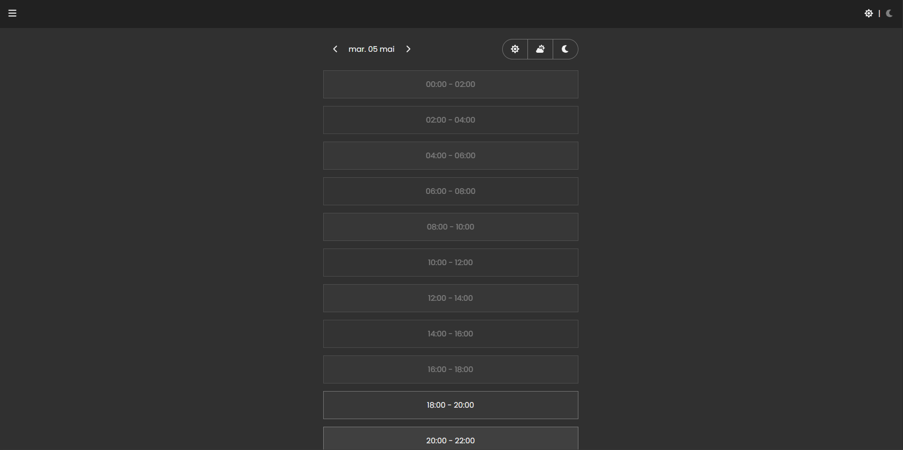

# Laundry Reservation App

A laundry room reservation app built with React, TypeScript, Supabase, TanStack Query, and Netlify, created for a real residential community to improve scheduling organization and reduce reservation conflicts.

Users can reserve laundry time slots, view their reservations, and cancel them. 

Admin users have access to a protected panel for inspecting reservations and deleting resident accounts.

## Screenshot




## Project Goals

This project was created with the purpose of reducing reservation conflicts and providing an easy way to organize the laundry room schedule for a real residential community.

In order to keep the app cost-free and permanently lightweight, I opted for free-tier services: Netlify for hosting and Supabase for the database. I also used GitHub Actions to run a daily script that deletes reservations older than 7 days.

To avoid the need for sensitive real user data, as well as reduce the weight and complexity of heavy login forms, I used a fake email system based on each resident’s unique door number. This allows admins to identify users through their door number while keeping that information private from other residents.

Thus, a need for roles arose.

- Users can inspect, create, and cancel their own reservations for any future time slot. As an abuse-prevention measure, each user is limited to a maximum of 2 active reservations.

- Admins can view all reservations and who they belong to, create reservations for themselves, inspect resident accounts, and delete users when necessary.


## Tech Stack

- React
- TypeScript
- Vite
- Supabase
- TanStack Query
- React Router
- Netlify


## Features

- Authentication with Supabase
- Protected user routes
- Role-based admin panel
- Time-slot reservation system
- Conflict handling for already-booked slots
- Maximum active reservation limit
- User reservation management
- Admin resident deletion flow
- Toast confirmation messages
- Light/dark theme support
- Responsive mobile-friendly UI


## Public Repository Note

This repository is a sanitized public version of the project.

The app was originally created for a real residential community, but all organization-specific details, private identifiers, production database connections, and sensitive backend configuration have been removed.

Because of that, the project is intended to demonstrate the frontend structure, user flow, UI decisions, and integration approach rather than serve as a fully plug-and-play production clone.

## Run Locally

### 1. Install dependencies

```bash
npm install
```

### 2. Create a .env file in the project root

```env
VITE_SUPABASE_URL=YOUR_SUPABASE_URL
VITE_SUPABASE_PUBLISHABLE_KEY=YOUR_SUPABASE_PUBLISHABLE_KEY
```

### 3. Start the development server

```bash
npm run dev
```

## Backend and Deployment Notes

The Supabase backend setup is not included in this public repository.

A full setup requires:

 - Supabase Auth
 - Database tables.
 - Row Level Security policies.
 - RPC functions.
 - An admin-only Edge Function.


## Status

This is a portfolio-ready public version of a real-use project. The production version was designed around a specific residential community, while this repository keeps the codebase public-safe by removing private backend and organization-specific details.